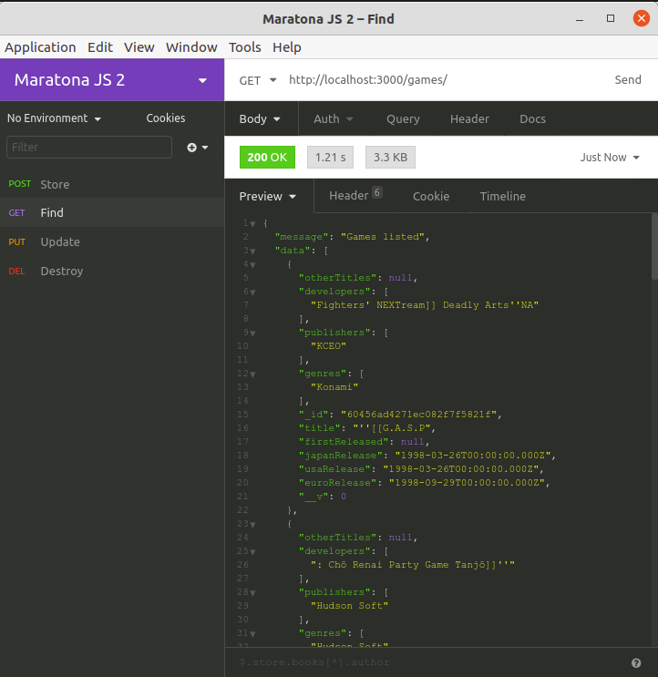
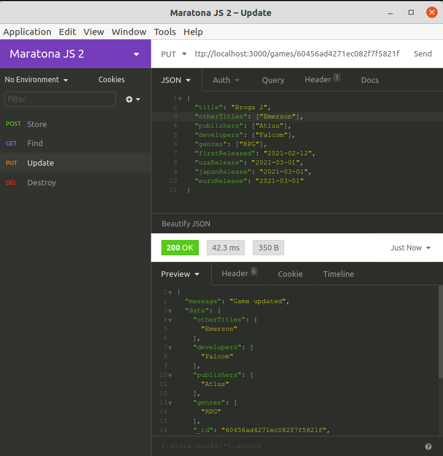
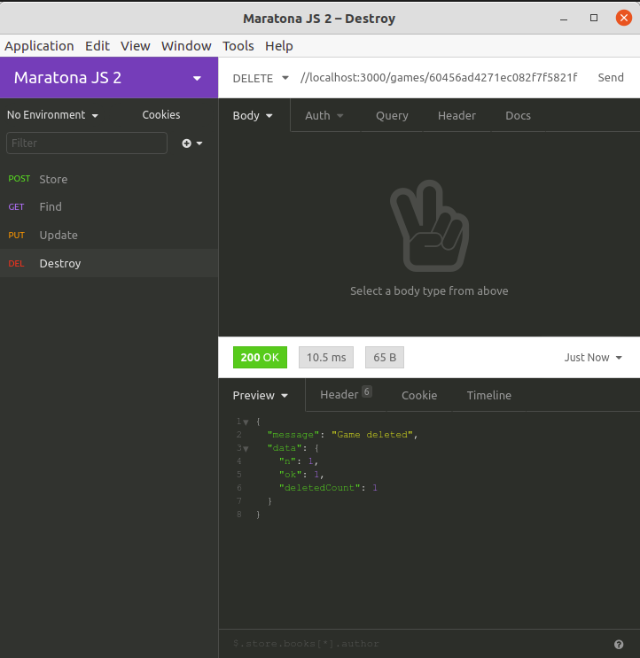
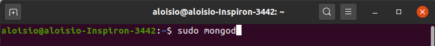
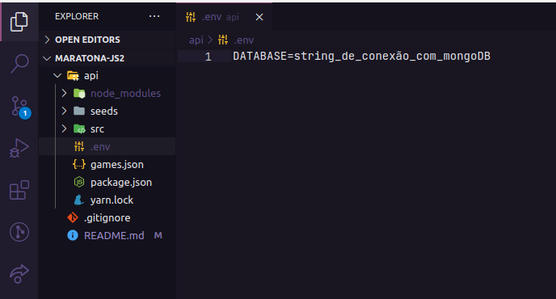
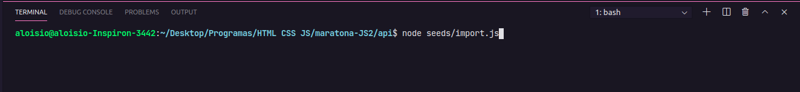

# Maratona JS 2

Projeto desenvolvido durante o evento Maratona JS 2 (29/03/2021 - 02/04/2021) por Emerson Broga. Inicialmente, a api irá buscar dados de um arquivo JSON e armazená-los no banco de dados MongoDB. Em seguida, o usuário poderá inserir, atualizar, listar e deletar dados do banco a partir de requisições http.

# Api

  

  

  

  

# Funcionalidades
 - Listar, inserir, atualizar e deletar dados
 - Paginação e parâmetros de busca

# Utilizar projeto
## Requisitos
    Instalar o Git
    https://git-scm.com/downloads

    Instalar o NodeJs
    https://nodejs.org/en/

    Instalar o MongoDB
    https://docs.mongodb.com/manual/administration/install-community/
## Primeiro passo - baixar o projeto
Faça download do repositório acima ou use o seguinte comando na pasta onde deseja baixar o projeto:
 - git clone https://github.com/AloisioFernandes/maratona-JS2.git

## Segundo passo - instalar dependências
Digite o seguinte comando dentro da pasta api através do terminal:
 - npm install

## Terceiro passo - configurar banco de dados
Utilize o comando mongod para iniciar o MongoDB:

Após isso, acesse a pasta api e crie um arquivo .env contendo a string de conexão com o banco MongoDB:

Em seguida, acesse novamente a pasta api e utilize o seguinte comando para inserir os dados iniciais no banco:
 - node seeds/import.js

## Quarto passo - acessar projeto
Acesse a pasta api e utilize o comando através do terminal:
 - npm start
As requisições poderão ser feitas pelo endereço: http://localhost:3000/games

# Principais Tecnologias
 - [NodeJS](https://nodejs.org/en/)
 - [MongoDB](https://docs.mongodb.com/)
 - [Express](https://expressjs.com/en/5x/api.html)